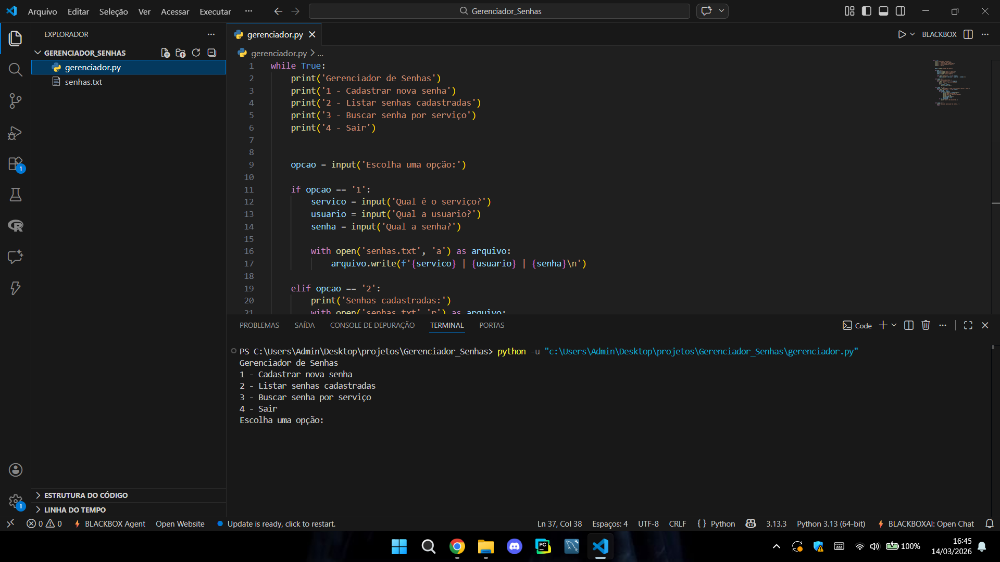

# gerenciador-senhas-python
Gerenciador de senhas simples feito em Python.

# Gerenciador de Senhas em Python

Projeto simples feito para praticar Python e manipulação de arquivos.

## Funcionalidades

- Cadastrar senha
- Listar senhas
- Buscar senha por serviço

## Tecnologias

- Python
- Manipulação de arquivos

## Exemplo de uso

